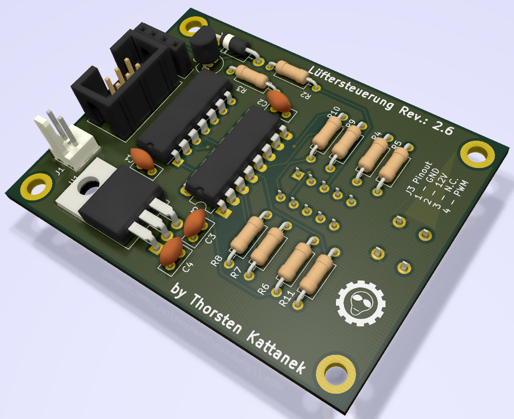
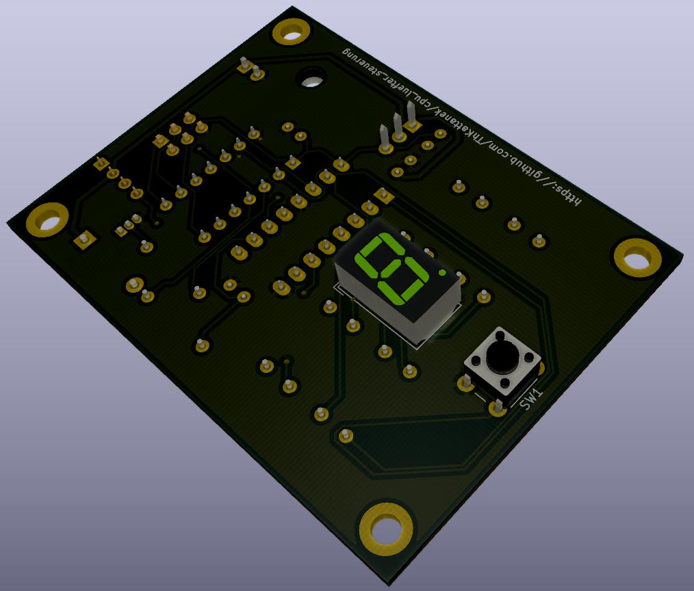

# CPU-Lüfter Steuerung
Steuerung eines CPU Lüfters per Attiny24a und Anzeige auf 7-Segmentanzeige. Bedienung per Taster.

### [Latest version here](https://github.com/ThKattanek/cpu_luefter_steuerung/releases/latest)

## Bilder

